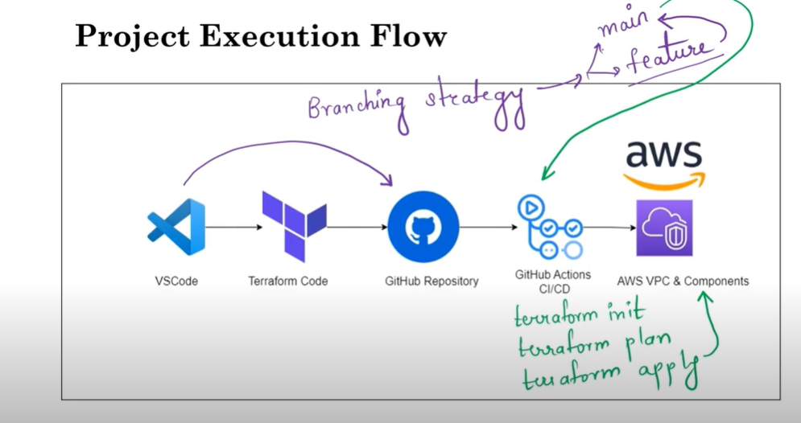
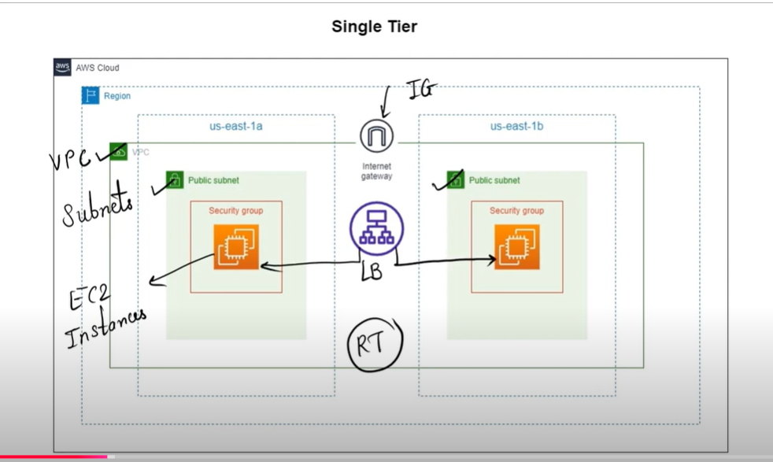

# VPC_Terraform_Github_Action
Link: https://www.youtube.com/watch?v=v4MP7fvLw44
https://www.notion.so/DevOps-Project-Mastering-VPC-Creation-with-Terraform-GitHub-Actions-Automation-13598ddfef5480d9bd55c16c5fd17661?pvs=4

Creating VPC Iaac and github Action as CICD

creating a Virtual Private Cloud (VPC) infrastructure using Terraform and then automating the deployment of  Terraform code using GitHub Actions.

1. Setting up Terraform:  initial setup of Terraform on your local machine

       a.  installed git bash 
       b.  installed terraform to windows 
       c.  installed aws cli
    
2. Writing Terraform Code:  VPC infrastructure
   
      a.   networks
      b.   subnets
      c.   security groups

3. Initializing and Applying Terraform:
   
4. GitHub Repository Setup:setting up a GitHub repository to store

     a.   Terraform code
     b.   README
     c.   .gitignore
     d.   essential files.
   
5. GitHub Actions Configuration: configure GitHub Actions workflows to automate the deployment of your Terraform code.

    a.   secrets management and workflow triggers on pushing the code to a specific branch.
    
6. Push to GitHub: See how to push  Terraform code to GitHub repository and trigger the GitHub Actions workflow.

7. Monitor and Verify: Learn how to monitor the progress of your GitHub Actions workflow and verify the successful deployment of  VPC infrastructure.

